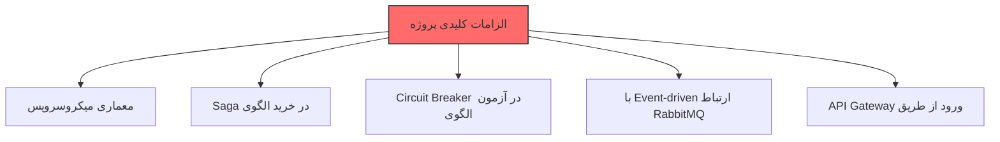
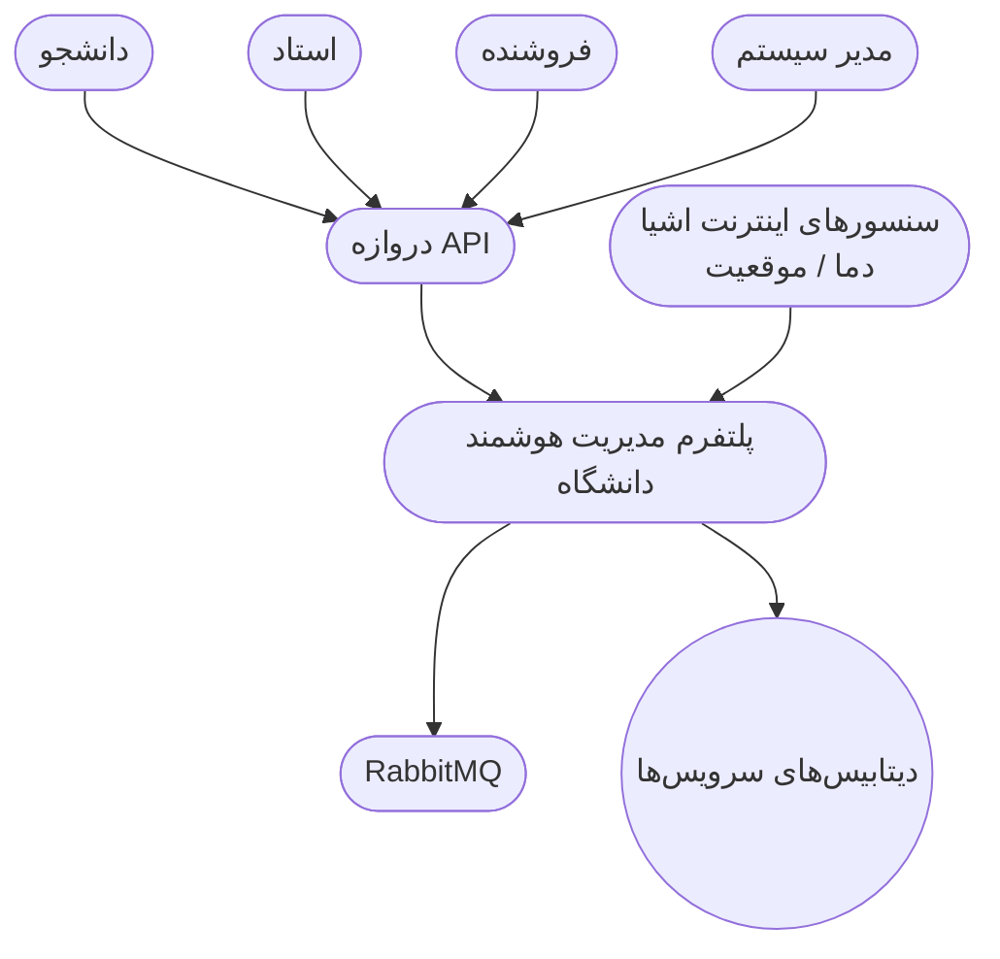
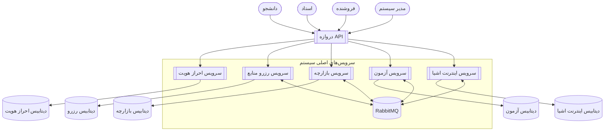
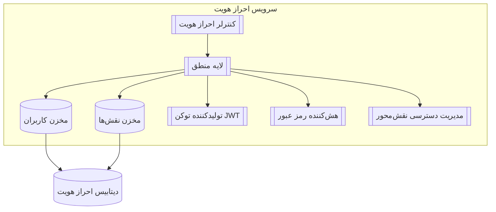
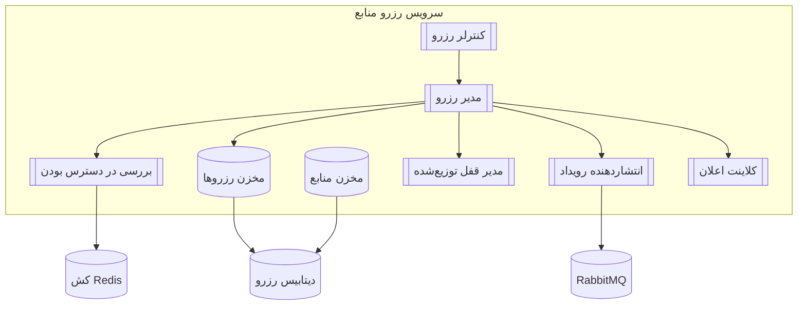
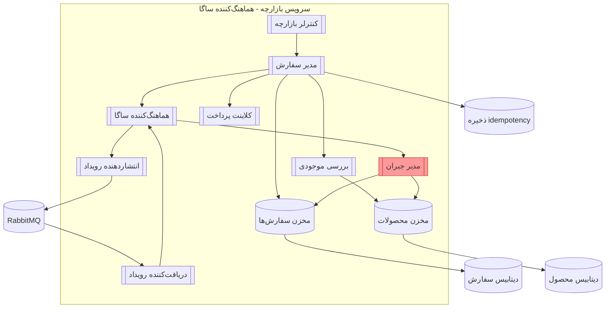
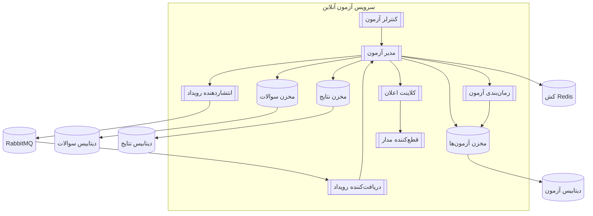
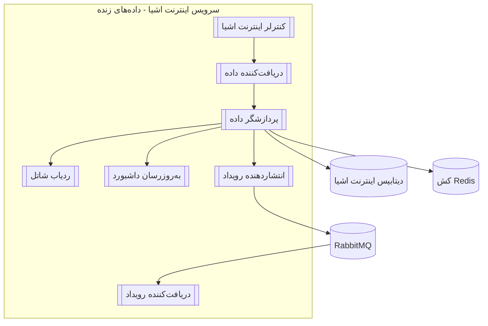

# 🎓 پروژه درس تحلیل و طراحی نرم‌افزار پیشرفته

**موضوع:** پلتفرم مدیریت هوشمند دانشگاه
**استاد:** دکتر فیضی
**مدت اجرا:** ۸ هفته
**تیم:** ۸ نفر + هوش مصنوعی (ChatGPT)

---

## 🔥 ۱. چشم‌انداز پروژه
ما می‌خواهیم یک سیستم واقعی و کاربردی بسازیم که شبیه پلتفرم‌های دانشگاهی بزرگ باشد. هدف اصلی ما یادگیری معماری میکروسرویس و الگوهای پیشرفته مثل Saga و Circuit Breaker است.

می‌خواهیم بدانیم چطور شرکت‌های بزرگ سیستم‌های مقیاس‌پذیر می‌سازند و چگونه با چالش‌های واقعی مثل مدیریت خطا و داده‌های توزیع شده روبرو می‌شوند.

برای ما کیفیت و یادگیری عمیق مهم‌تر از تکمیل سریع پروژه است. می‌خواهیم در پایان بتوانیم با اطمینان بگوییم که از پس طراحی و پیاده‌سازی یک سیستم Enterprise-Level برمی‌آییم.

این پروژه برای ما مثل یک دوره عملی آماده‌سازی برای بازار کار است.

---

## 🚨 ۲. الزامات کلیدی 

✔ Microservices
✔ Saga Pattern
✔ Circuit Breaker
✔ RabbitMQ
✔ API Gateway

---
## ۳. نیازمندی‌ها

۳.۱ نیازمندی‌های عملکردی (Functional Requirements)

| کد     | سرویس          | نیازمندی                              | توضیح                                  |
|--------|----------------|----------------------------------------|----------------------------------------|
| FR-01  | احراز هویت     | ثبت‌نام و ورود                        | با توکن JWT                           |
| FR-02  | احراز هویت     | صدور توکن JWT                         | توکن ورود                             |
| FR-03  | رزرو منابع     | مشاهده منابع (اتاق، کلاس و …)          | لیست موجودی                           |
| FR-04  | رزرو منابع     | رزرو + جلوگیری از رزرو بیش از حد      | قفل توزیع‌شده + چک تداخل             |
| FR-05  | بازارچه         | تعریف محصول توسط فروشنده              | بارگذاری کالا                         |
| FR-06  | بازارچه         | خرید چندمرحله‌ای                      | با الگوی ساگا                         |
| FR-07  | آزمون           | ساخت آزمون توسط استاد                  | سوالات و زمان‌بندی                    |
| FR-08  | آزمون           | شرکت در آزمون + قطع‌کننده مدار         | اعلان شروع آزمون                      |
| FR-09  | اینترنت اشیا    | دریافت داده زنده سنسور                | دما، رطوبت، حضور و …                 |
| FR-10  | اینترنت اشیا    | نقشه زنده شاتل دانشگاه                | موقعیت GPS                            |

۳.۲ نیازمندی‌های غیرعملکردی (Non-Functional Requirements)

| کد         | عنوان                   | پیامد معماری                                   |
|------------|------------------------|------------------------------------------------|
| NFR-S01    | مقیاس‌پذیری افقی       | سرویس‌ها کاملاً بدون حالت (Stateless)         |
| NFR-MT01   | چندمستأجری             | جداسازی در سطح اسکیما (Schema-per-Tenant)     |
| NFR-P01    | عملکرد بالا             | کش (Cache) + پردازش ناهمزمان (Async)         |
| NFR-SE01   | امنیت                   | توکن JWT + مدیریت دسترسی نقش‌محور (RBAC)      |
| NFR-R01    | تحمل خطا               | الگوی ساگا + قطع‌کننده مدار                  |

---
## ۴. دیاگرام‌های C4

Level 1 – نمای کلی سیستم (System Context)

Level 2 – دیاگرام کانتینرها (Container Diagram)

Level 3 — سرویس احراز هویت (Auth Service)

Level 3 — سرویس رزرو منابع (Booking Service)

Level 3 — سرویس بازارچه (Marketplace Service - الگوی ساگا)

Level 3 — سرویس آزمون (Exam Service - قطع‌کننده مدار)

Level 3 — سرویس اینترنت اشیا (IoT Service)

---
## ۵. تصمیم‌گیری‌های معماری (Architecture Decision Records - ADR)

مشاهده فهرست کامل تصمیم‌گیری‌های معماری (ADR)

✔ **ADR-001** — انتخاب معماری میکروسرویس‌ها به‌جای مونولیتیک  
در این پروژه نیازمند استقلال سرویس‌ها، توسعه‌ی مستقل، مقیاس‌پذیری جداگانه و مدیریت ساده‌تر بودیم. معماری مونولیتیک با بزرگ شدن پروژه پیچیده و کند می‌شود، اما معماری میکروسرویس‌ها امکان توسعه‌ی مستقل با دیتابیس و تکنولوژی مخصوص هر سرویس را فراهم می‌کند و عایق‌بندی خطا (Fault Isolation) را به شکل بسیار بهتری تضمین می‌کند.

✔ **ADR-002** — انتخاب توکن JWT به‌جای Session  
در معماری میکروسرویس، استفاده از Session باعث وابستگی و ذخیره‌سازی حالت می‌شود. توکن JWT سرویس‌ها را کاملاً بدون حالت (Stateless) نگه می‌دارد و دروازه API مسئولیت اعتبارسنجی توکن را بر عهده دارد.

✔ **ADR-003** — استفاده از دروازه API (API Gateway)  
دروازه API نقطه‌ی ورود واحد و امن به کل سیستم است و امکان مدیریت احراز هویت، جلوگیری از حملات، ساده‌سازی مسیریابی و کاهش پیچیدگی سمت کلاینت را فراهم می‌کند.

✔ **ADR-004** — انتخاب RabbitMQ برای ارتباط رویدادمحور  
RabbitMQ بهترین گزینه برای ارتباط غیرهمزمان، کاملاً جدا شده و مقاوم در برابر خطا بین سرویس‌هاست. قابلیت‌هایی مانند تلاش مجدد، مسیریابی پیشرفته و صف مرده از اثر زنجیره‌ای خرابی‌ها جلوگیری می‌کند.

✔ **ADR-005** — استفاده از الگوی ساگا (Saga) در فرآیند خرید  
فرآیند خرید چندمرحله‌ای و توزیع‌شده است و هماهنگی دو مرحله‌ای (2PC) قابل استفاده نیست. الگوی ساگا با ترکیب اقدام اصلی و جبران‌کننده، مدیریت خطا را به شکل قابل‌اعتماد انجام می‌دهد.

✔ **ADR-006** — استفاده از الگوی قطع‌کننده مدار (Circuit Breaker) در سرویس آزمون  
برای جلوگیری از شکست آبشاری هنگام از کار افتادن سرویس اعلان، از الگوی قطع‌کننده مدار استفاده شده تا مکانیزم شکست سریع فعال شود.

✔ **ADR-007** — انتخاب Redis برای کش و قفل توزیع‌شده  
Redis به دلیل سرعت بالا، زمان انقضا و پشتیبانی از قفل توزیع‌شده انتخاب شد؛ برای جلوگیری از رزرو بیش از حد و پردازش سریع داده‌های اینترنت اشیا ضروری است.

✔ **ADR-008** — انتخاب الگوی دیتابیس مجزا برای هر سرویس (Database-per-Service)  
هر سرویس دیتابیس کاملاً جداگانه‌ای دارد تا وابستگی داده‌ای حذف شود.

✔ **ADR-009** — انتخاب الگوی جداسازی در سطح اسکیما برای چندمستأجری (Schema-per-Tenant)  
برای پشتیبانی همزمان از چندین دانشگاه، داده‌ها در سطح اسکیما جدا شده‌اند تا امنیت، ایزولاسیون و مدیریت پشتیبان‌گیری ساده‌تر شود.

