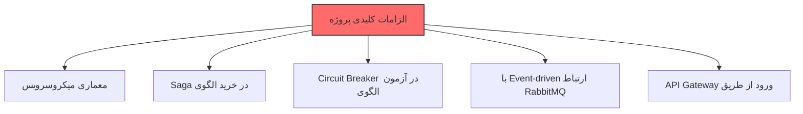
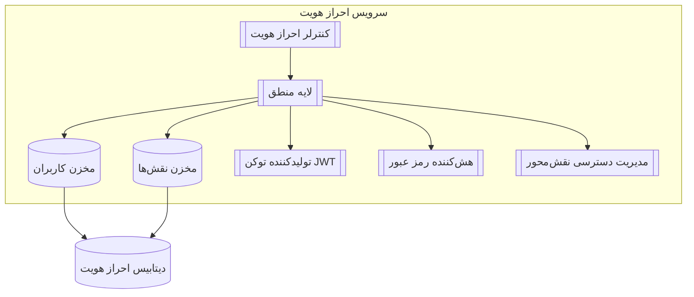
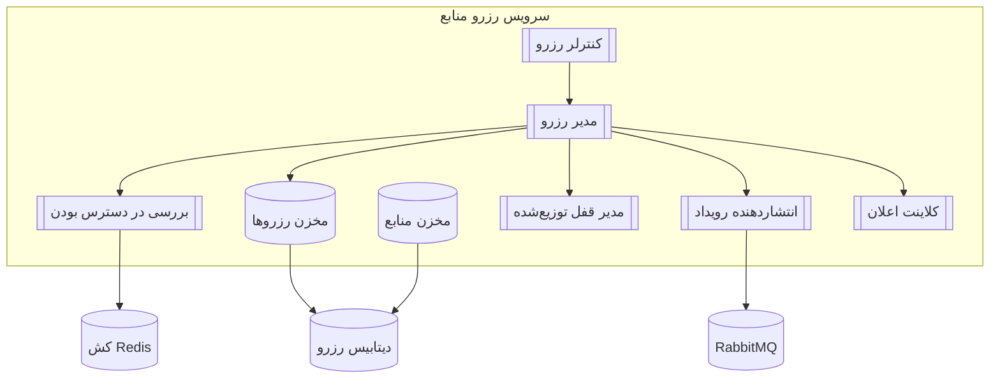
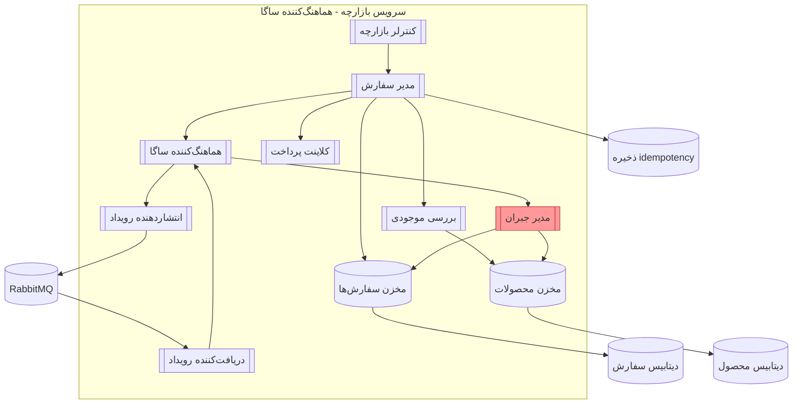
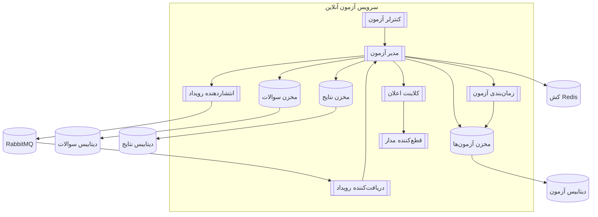
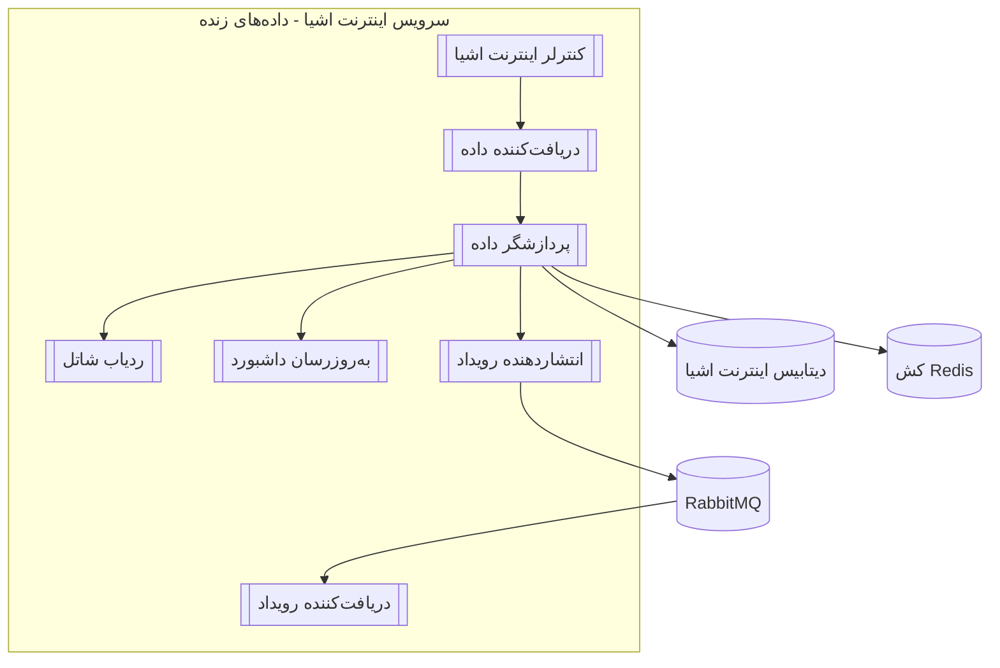

# 🎓 پروژه درس تحلیل و طراحی نرم‌افزار پیشرفته

**موضوع:** پلتفرم مدیریت هوشمند دانشگاه
**استاد:** دکتر فیضی
**مدت اجرا:** ۸ هفته
**تیم:** ۸ نفر + هوش مصنوعی (ChatGPT)

---

## 🔥 ۱. چشم‌انداز پروژه
ما می‌خواهیم یک سیستم واقعی و کاربردی بسازیم که شبیه پلتفرم‌های دانشگاهی بزرگ باشد. هدف اصلی ما یادگیری معماری میکروسرویس و الگوهای پیشرفته مثل Saga و Circuit Breaker است.

می‌خواهیم بدانیم چطور شرکت‌های بزرگ سیستم‌های مقیاس‌پذیر می‌سازند و چگونه با چالش‌های واقعی مثل مدیریت خطا و داده‌های توزیع شده روبرو می‌شوند.

برای ما کیفیت و یادگیری عمیق مهم‌تر از تکمیل سریع پروژه است. می‌خواهیم در پایان بتوانیم با اطمینان بگوییم که از پس طراحی و پیاده‌سازی یک سیستم Enterprise-Level برمی‌آییم.

این پروژه برای ما مثل یک دوره عملی آماده‌سازی برای بازار کار است.

---

## 🚨 ۲. الزامات کلیدی 

✔ Microservices
✔ Saga Pattern
✔ Circuit Breaker
✔ RabbitMQ
✔ API Gateway

---
## ۳. نیازمندی‌ها

۳.۱ نیازمندی‌های عملکردی (Functional Requirements)

| کد     | سرویس          | نیازمندی                              | توضیح                                  |
|--------|----------------|----------------------------------------|----------------------------------------|
| FR-01  | احراز هویت     | ثبت‌نام و ورود                        | با توکن JWT                           |
| FR-02  | احراز هویت     | صدور توکن JWT                         | توکن ورود                             |
| FR-03  | رزرو منابع     | مشاهده منابع (اتاق، کلاس و …)          | لیست موجودی                           |
| FR-04  | رزرو منابع     | رزرو + جلوگیری از رزرو بیش از حد      | قفل توزیع‌شده + چک تداخل             |
| FR-05  | بازارچه         | تعریف محصول توسط فروشنده              | بارگذاری کالا                         |
| FR-06  | بازارچه         | خرید چندمرحله‌ای                      | با الگوی ساگا                         |
| FR-07  | آزمون           | ساخت آزمون توسط استاد                  | سوالات و زمان‌بندی                    |
| FR-08  | آزمون           | شرکت در آزمون + قطع‌کننده مدار         | اعلان شروع آزمون                      |
| FR-09  | اینترنت اشیا    | دریافت داده زنده سنسور                | دما، رطوبت، حضور و …                 |
| FR-10  | اینترنت اشیا    | نقشه زنده شاتل دانشگاه                | موقعیت GPS                            |

۳.۲ نیازمندی‌های غیرعملکردی (Non-Functional Requirements)

| کد         | عنوان                   | پیامد معماری                                   |
|------------|------------------------|------------------------------------------------|
| NFR-S01    | مقیاس‌پذیری افقی       | سرویس‌ها کاملاً بدون حالت (Stateless)         |
| NFR-MT01   | چندمستأجری             | جداسازی در سطح اسکیما (Schema-per-Tenant)     |
| NFR-P01    | عملکرد بالا             | کش (Cache) + پردازش ناهمزمان (Async)         |
| NFR-SE01   | امنیت                   | توکن JWT + مدیریت دسترسی نقش‌محور (RBAC)      |
| NFR-R01    | تحمل خطا               | الگوی ساگا + قطع‌کننده مدار                  |

---
## ۴. دیاگرام‌های C4

Level 1 – نمای کلی سیستم (System Context)

Level 2 – دیاگرام کانتینرها (Container Diagram)

Level 3 — سرویس احراز هویت (Auth Service)

Level 3 — سرویس رزرو منابع (Booking Service)

Level 3 — سرویس بازارچه (Marketplace Service - الگوی ساگا)

Level 3 — سرویس آزمون (Exam Service - قطع‌کننده مدار)

Level 3 — سرویس اینترنت اشیا (IoT Service)

---

## ۵. تصمیم‌گیری‌های معماری (Architecture Decision Records - ADR)

### 📌 فهرست ADRها
- **ADR-001** — Microservices Architecture  
- **ADR-002** — JWT-based Authentication  
- **ADR-003** — API Gateway  
- **ADR-004** — Event-driven Communication (RabbitMQ)  
- **ADR-005** — Saga Pattern for Purchase Flow  
- **ADR-006** — Circuit Breaker in Exam Service  
- **ADR-007** — Redis for Cache & Distributed Lock  
- **ADR-008** — Database-per-Service  
- **ADR-009** — Multi-Tenancy with Schema-per-Tenant  

---

<b>ADR-001</b> —  Microservices انتخاب معماری 

**Status:** Accepted  

**Context:**  
سیستم شامل دامنه‌های مستقل مانند احراز هویت، رزرو منابع، بازارچه، آزمون آنلاین و اینترنت اشیا است. نیاز به مقیاس‌پذیری، توسعه مستقل و تحمل خطا وجود دارد که معماری مونولیتیک پاسخ‌گوی آن نیست.

**Decision:**  
معماری Microservices انتخاب شد؛ هر قابلیت به‌صورت سرویس مستقل با چرخه توسعه و استقرار جداگانه پیاده‌سازی می‌شود.

**Consequences:**  
- مزایا: مقیاس‌پذیری مستقل، Fault Isolation، توسعه موازی  
- معایب: پیچیدگی DevOps، نیاز به مانیتورینگ و لاگ‌گیری پیشرفته  

<b>ADR-002</b> — JWT استفاده از احراز هویت مبتنی بر 

**Status:** Accepted  

**Context:**  
در معماری میکروسرویس، استفاده از Session باعث Stateful شدن سرویس‌ها و دشواری در Scale-out می‌شود.

**Decision:**  
احراز هویت مبتنی بر JWT انتخاب شد. سرویس Auth توکن صادر می‌کند و API Gateway مسئول اعتبارسنجی آن است.

**Consequences:**  
- مزایا: Stateless بودن، سازگاری با مقیاس‌پذیری افقی  
- معایب: ابطال توکن دشوارتر، نیاز به مدیریت امن کلیدها  

<b>ADR-003</b> — استفاده از API Gateway

**Status:** Accepted  

**Context:**  
دسترسی مستقیم کلاینت به سرویس‌ها باعث افزایش پیچیدگی، مشکلات امنیتی و سختی مدیریت نسخه‌ها می‌شود.

**Decision:**  
API Gateway به‌عنوان نقطه ورود واحد برای Routing، Authentication، Rate Limiting و مدیریت نسخه‌ها استفاده شد.

**Consequences:**  
- مزایا: امنیت متمرکز، کاهش پیچیدگی کلاینت  
- معایب: Single Point of Failure (نیازمند HA)  

<b>ADR-004</b> — ارتباط رویدادمحور با RabbitMQ

**Status:** Accepted  

**Context:**  
ارتباط Sync بین سرویس‌ها Coupling بالا و شکست آبشاری ایجاد می‌کند.

**Decision:**  
ارتباط Event-driven با RabbitMQ برای ارتباط ناهمزمان بین سرویس‌ها انتخاب شد.

**Consequences:**  
- مزایا: کاهش Coupling، افزایش Fault Tolerance  
- معایب: دیباگ سخت‌تر، نیاز به Correlation ID  

<b>ADR-005</b> — استفاده از الگوی Saga در فرآیند خرید

**Status:** Accepted  

**Context:**  
فرآیند خرید توزیع‌شده و چندمرحله‌ای است و استفاده از 2PC مناسب نیست.

**Decision:**  
الگوی Saga (مدل Orchestration-based) برای مدیریت تراکنش‌های توزیع‌شده انتخاب شد.

**Consequences:**  
- مزایا: مدیریت خطا و جبران بدون 2PC  
- معایب: پیچیدگی منطق و نیاز به Idempotency  

<b>ADR-006</b> — استفاده از Circuit Breaker در سرویس آزمون

**Status:** Accepted  

**Context:**  
خرابی سرویس‌های وابسته (مانند اعلان) نباید باعث از کار افتادن سرویس آزمون شود.

**Decision:**  
الگوی Circuit Breaker برای فراخوانی‌های حساس در سرویس آزمون استفاده شد تا Fail Fast فعال شود.

**Consequences:**  
- مزایا: جلوگیری از Failure Cascading، افزایش دسترس‌پذیری  
- معایب: نیاز به تنظیم دقیق Thresholdها  

<b>ADR-007</b> — استفاده از Redis برای کش و قفل توزیع‌شده

**Status:** Accepted  

**Context:**  
رزرو منابع نیازمند جلوگیری از Overbooking و پاسخ‌دهی سریع است.

**Decision:**  
Redis برای Cache و Distributed Lock (با TTL) انتخاب شد.

**Consequences:**  
- مزایا: افزایش Performance، کاهش بار دیتابیس  
- معایب: نیاز به طراحی دقیق قفل‌ها و HA  

<b>ADR-008</b> — Database-per-Service

**Status:** Accepted  

**Context:**  
اشتراک دیتابیس بین سرویس‌ها استقلال میکروسرویس‌ها را نقض می‌کند و Coupling ایجاد می‌کند.

**Decision:**  
هر سرویس دیتابیس اختصاصی خود را دارد و تبادل داده فقط از طریق API یا Event انجام می‌شود.

**Consequences:**  
- مزایا: Data Isolation، استقلال سرویس‌ها  
- معایب: سختی Query بین‌سرویسی و گزارش‌گیری  

<b>ADR-009</b> —  Schema-per-Tenant چندمستأجری با 

**Status:** Accepted  

**Context:**  
سیستم باید چند دانشگاه را با ایزولاسیون داده و امنیت بالا پشتیبانی کند.

**Decision:**  
الگوی Schema-per-Tenant برای جداسازی داده هر Tenant انتخاب شد.

**Consequences:**  
- مزایا: ایزولاسیون قوی، Backup ساده‌تر  
- معایب: Migration پیچیده‌تر با افزایش Tenantها  

